# Encryption and Data Encoding

This document details how client data is encrypted, how encrypted blobs are structured, and how those blobs map onto protocol fields. It is based on `apps/cli/src/api/encryption.ts` and the server routes that accept/emit these values.

For transport and event shapes, see `protocol.md`. For HTTP endpoints, see `api.md`.

## Overview

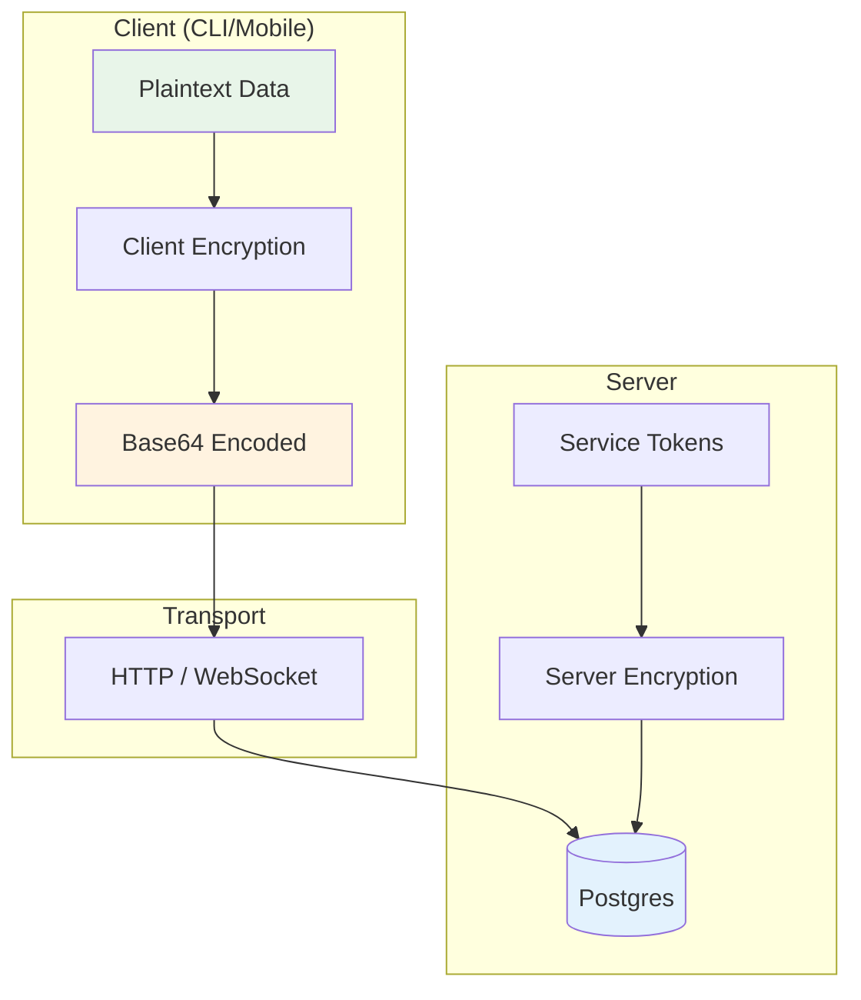

## Design goals
- Keep the server blind to user content (end-to-end encryption on clients).
- Use explicit, stable binary layouts so clients can interoperate across versions.
- Prefer simple, consistent base64 encoding on the wire.

## Encryption variants

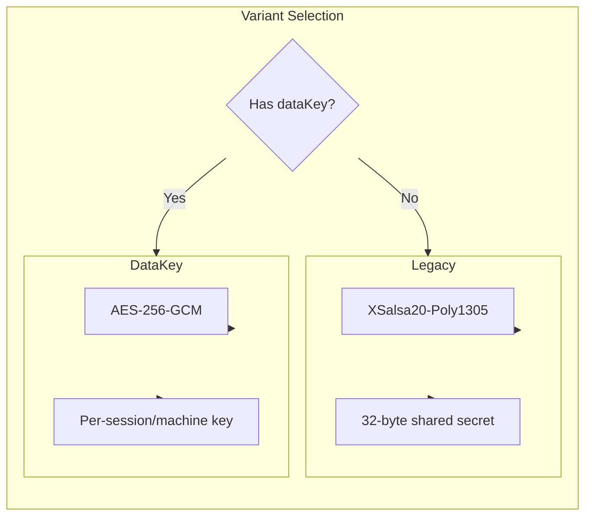

Clients currently use one of two encryption variants:

### 1) legacy (NaCl secretbox)
Used when the client only has a shared secret key.

**Algorithm**: `tweetnacl.secretbox` (XSalsa20-Poly1305)
- **Nonce length**: 24 bytes
- **Key length**: 32 bytes

**Binary layout** (plaintext JSON -> bytes):
```
[ nonce (24) | ciphertext+auth (secretbox output) ]
```

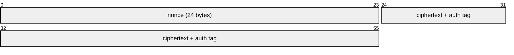

### 2) dataKey (AES-256-GCM)
Used when the client supports per-session/per-machine data keys.

**Algorithm**: AES-256-GCM
- **Nonce length**: 12 bytes
- **Auth tag**: 16 bytes
- **Key length**: 32 bytes

**Binary layout**:
```
[ version (1) | nonce (12) | ciphertext (...) | authTag (16) ]
```

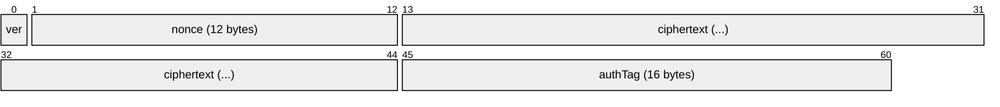

- `version` is currently `0`.

## Data encryption key (dataKey variant)

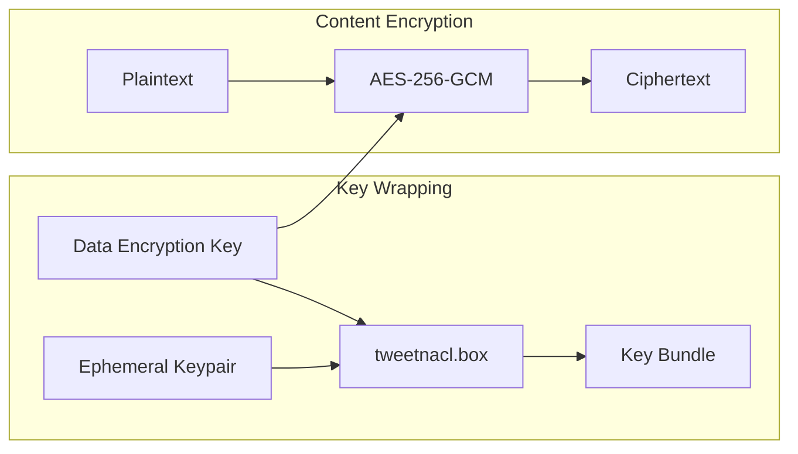

When `dataKey` is used, the actual content key is encrypted for storage/transport.

**Algorithm**: `tweetnacl.box` with an ephemeral keypair.
- **Ephemeral public key**: 32 bytes
- **Nonce**: 24 bytes

**Binary layout**:
```
[ ephPublicKey (32) | nonce (24) | ciphertext (...) ]
```

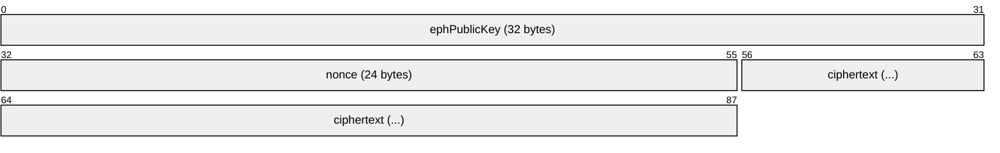

This blob is then wrapped with a version byte before being sent/stored:
```
[ version (1 = 0) | boxBundle (...) ]
```

The resulting bytes are base64-encoded and placed in fields such as `dataEncryptionKey` for sessions/machines/artifacts.

## Where encryption is applied

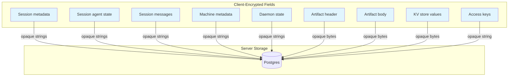

The server treats these fields as opaque strings/blobs. The client encrypts them before sending.

### Session metadata + agent state
- **Encrypted by client** and stored as strings in the DB.
- Used in:
  - `POST /v1/sessions` (create/load)
  - WebSocket `update-metadata` / `update-state`
  - `update-session` events

### Session messages

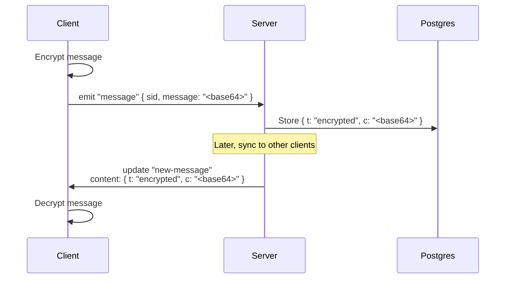

- Client emits `message` with a base64 encrypted blob.
- Server stores it as `SessionMessage.content`:
  - `{ t: "encrypted", c: "<base64>" }`
- Server emits it back in `new-message` updates with the same structure.

### Machine metadata + daemon state
- **Encrypted by client** and stored as strings in the DB.
- Used in:
  - `POST /v1/machines`
  - WebSocket `machine-update-metadata` / `machine-update-state`
  - `update-machine` events

### Artifacts
- `header` and `body` are encrypted bytes encoded as base64 on the wire.
- Stored as `Bytes` in the DB.
- Emitted in `new-artifact` / `update-artifact` events as base64 strings.

### Access keys
- `AccessKey.data` is treated as an **opaque encrypted string**.
- The server does not decode it or inspect its contents.

### Key-value store
- `UserKVStore.value` is encrypted bytes encoded as base64 on the wire.
- `kvMutate` expects base64 strings; `kvGet/list/bulk` return base64 strings.

Session drafts reserve a typed `UserKVStore` key prefix instead of exposing their rows through the
generic KV API. The draft routes carry an explicit content envelope and enforce its owner:

- a new-Session draft follows the Account encryption mode and uses Account-scoped key material;
- an existing-Session draft follows that Session's fixed encryption mode and, in E2EE mode, uses
  the Session data-encryption key;
- raw attachment bytes, local file handles and URIs, credentials, secret values, and local
  presentation state are not part of synchronized draft content.

This keeps one draft document and synchronization contract without weakening the different key
ownership of Account-scoped and Session-scoped data.

Snapshot hydration distinguishes a temporarily unavailable existing-Session key/context from an
invalid envelope or payload. It may skip only the unavailable Session record while continuing to
materialize other Account drafts; malformed or mode-incompatible content fails the snapshot so it
cannot be silently classified as a local key-loading condition.

## On-wire formats (encrypted fields)

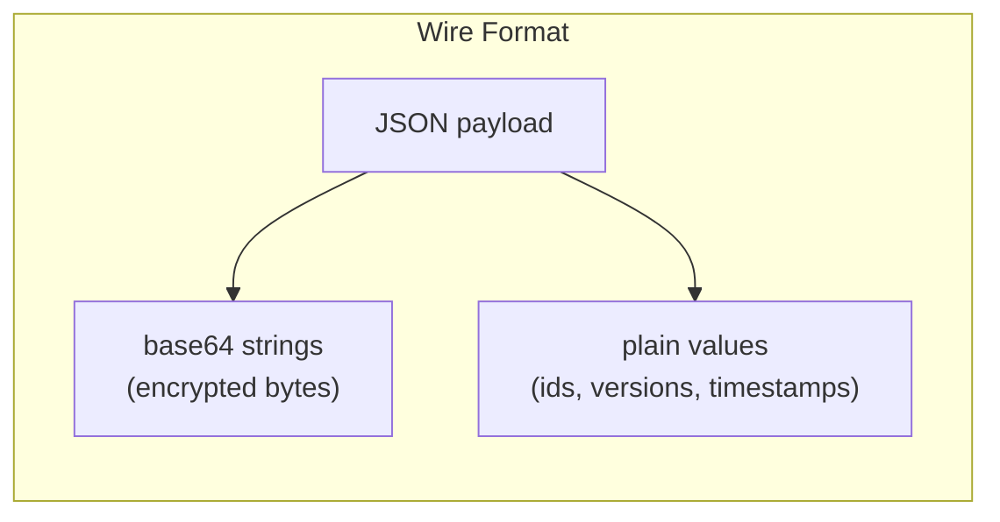

Below are the typical JSON shapes that carry encrypted data. All `...` values are base64 strings representing encrypted bytes.

### Session creation
```http
POST /v1/sessions
```
```json
{
  "tag": "<string>",
  "metadata": "<base64 encrypted>",
  "agentState": "<base64 encrypted or null>",
  "dataEncryptionKey": "<base64 data key bundle or null>"
}
```

### Encrypted message (client -> server)
```
Socket emit: "message"
```
```json
{
  "sid": "<session id>",
  "message": "<base64 encrypted>"
}
```

### Encrypted message (server -> client)
```
update.body.t = "new-message"
```
```json
{
  "t": "encrypted",
  "c": "<base64 encrypted>"
}
```

### Session metadata update (WebSocket)
```
Socket emit: "update-metadata"
```
```json
{
  "sid": "<session id>",
  "metadata": "<base64 encrypted>",
  "expectedVersion": 3
}
```

### Machine update (WebSocket)
```
Socket emit: "machine-update-state"
```
```json
{
  "machineId": "<machine id>",
  "daemonState": "<base64 encrypted>",
  "expectedVersion": 2
}
```

### Artifact create/update (HTTP)
```http
POST /v1/artifacts
```
```json
{
  "id": "<uuid>",
  "header": "<base64 encrypted>",
  "body": "<base64 encrypted>",
  "dataEncryptionKey": "<base64 data key bundle>"
}
```

### KV mutate (HTTP)
```http
POST /v1/kv
```
```json
{
  "mutations": [
    { "key": "prefs.theme", "value": "<base64 encrypted>", "version": 2 },
    { "key": "prefs.legacy", "value": null, "version": 5 }
  ]
}
```

## Client-side types (shapes used before encryption)
These are the client-side structures that get encrypted and sent over the wire. They are defined in `apps/cli/src/api/types.ts`.

### Session message content (encrypted)
The payload stored in `SessionMessage.content` is always encrypted and wrapped as:
```json
{ "t": "encrypted", "c": "<base64 encrypted>" }
```

### Encrypted message payload (plaintext before encryption)
Messages are encrypted as `MessageContent` and then base64 encoded:

**User message**
```json
{
  "role": "user",
  "content": { "type": "text", "text": "..." },
  "localKey": "...",
  "meta": { }
}
```

**Agent message**
```json
{
  "role": "agent",
  "content": { "type": "output | codex | acp | event", "data": "..." },
  "meta": { }
}
```

### Metadata (encrypted)
```json
{
  "path": "...",
  "host": "...",
  "homeDir": "...",
  "happyHomeDir": "...",
  "happyLibDir": "...",
  "happyToolsDir": "...",
  "version": "...",
  "name": "...",
  "os": "...",
  "summary": { "text": "...", "updatedAt": 123 },
  "machineId": "...",
  "claudeSessionId": "...",
  "tools": ["..."],
  "slashCommands": ["..."],
  "startedFromDaemon": true,
  "hostPid": 12345,
  "startedBy": "daemon | terminal",
  "lifecycleState": "running | archiveRequested | archived",
  "lifecycleStateSince": 123,
  "archivedBy": "...",
  "archiveReason": "...",
  "flavor": "..."
}
```

### Agent state (encrypted)
```json
{
  "controlledByUser": true,
  "requests": {
    "<id>": { "tool": "...", "arguments": {}, "createdAt": 123 }
  },
  "completedRequests": {
    "<id>": {
      "tool": "...",
      "arguments": {},
      "createdAt": 123,
      "completedAt": 123,
      "status": "canceled | denied | approved",
      "reason": "...",
      "mode": "default | acceptEdits | bypassPermissions | plan | read-only | safe-yolo | yolo",
      "decision": "approved | approved_for_session | denied | abort",
      "allowTools": ["..."]
    }
  }
}
```

### Machine metadata (encrypted)
```json
{
  "host": "...",
  "platform": "...",
  "happyCliVersion": "...",
  "homeDir": "...",
  "happyHomeDir": "...",
  "happyLibDir": "..."
}
```

### Daemon state (encrypted)
```json
{
  "status": "running | shutting-down",
  "pid": 123,
  "httpPort": 123,
  "startedAt": 123,
  "shutdownRequestedAt": 123,
  "shutdownSource": "mobile-app | cli | os-signal | unknown"
}
```

## Decryption flow (client side)

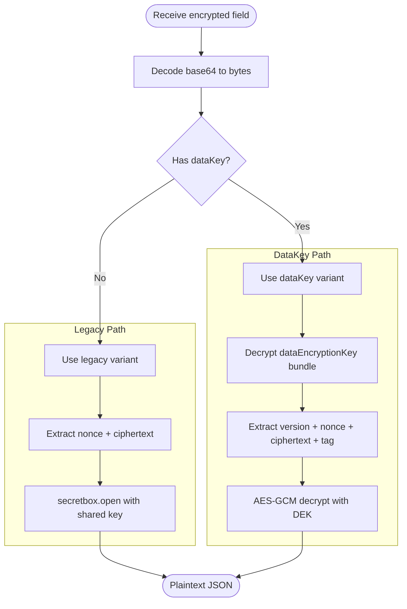

- Read base64 field from API/Socket.
- Decode base64 to bytes.
- Choose encryption variant (`legacy` or `dataKey`) based on local credentials.
- Decrypt bytes using the appropriate key and algorithm.

For `dataKey`, clients must first decrypt or derive the per-session/per-machine data key from the stored `dataEncryptionKey` bundle.

## Server-side encryption (service tokens)

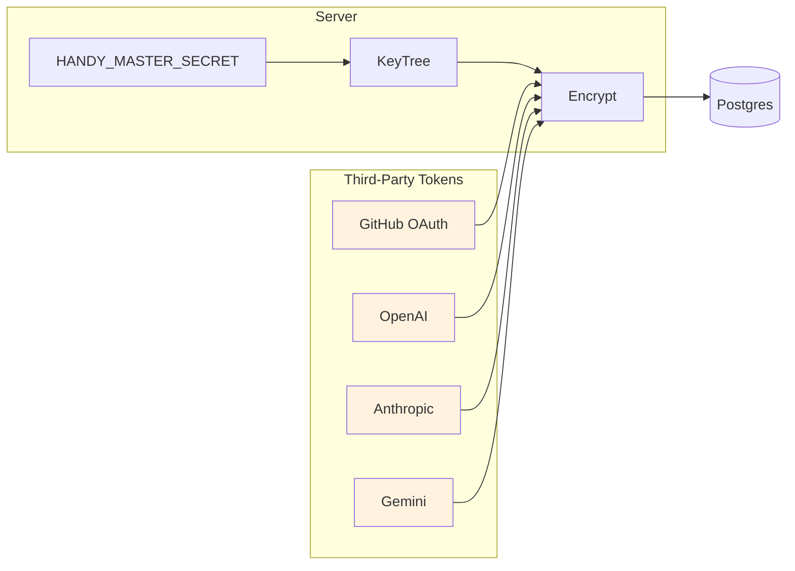

The server encrypts certain third-party tokens at rest:
- GitHub OAuth tokens (`GithubUser.token`).
- Vendor service tokens (`ServiceAccountToken.token`).

These are encrypted with a server-only KeyTree derived from `HANDY_MASTER_SECRET` and are not end-to-end encrypted.

## Encoding conventions

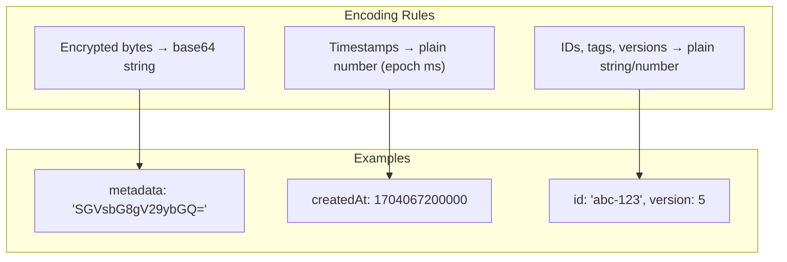

- All encrypted bytes are base64 strings on the wire unless explicitly noted.
- Timestamps remain plain numbers (epoch ms) and are not encrypted by the server.
- Non-encrypted identifiers (ids, tags, versions) are always plain strings/numbers.

## Session storage modes

Sessions can store transcript content in encrypted-at-rest or plaintext-at-rest mode. This is a storage mode, not a transport-security or authentication mode.

Canonical concepts:

- **Server storage policy:** `required_e2ee | optional | plaintext_only`, surfaced through `/v1/features`.
- **Account encryption mode:** `e2ee | plain`, used as the default for new sessions.
- **Session encryption mode:** `e2ee | plain`, fixed at session creation so a transcript does not mix modes.
- **Client encryption requirement:** `follow_account | require_e2ee`, resolved strongest-wins from the synced Account preference, a UI device-local pin, and the daemon's `HAPPIER_ENCRYPTION_REQUIREMENT` override.
- **Content envelope:**
  - encrypted content: `{ t: 'encrypted', c: string }`
  - plaintext content: `{ t: 'plain', v: unknown }`

Write paths must enforce mode/content-kind compatibility:

- `e2ee` sessions accept encrypted content only.
- `plain` sessions accept plain content only.

Clients must parse the envelope and branch explicitly. Do not guess that content is encrypted.

`require_e2ee` is enforced at the Account-settings and Session-content choke points. A client must reject a plaintext Account envelope before publishing it, reject plaintext session creation or a create-or-load response, and avoid opening or authoring plaintext Session content. The UI device-local pin remains scoped with the existing server/account settings persistence; the synced preference reaches a daemon through the existing Account-settings snapshot and pre-spawn minimum-version hint. No relay API or separate UI-to-daemon policy field owns this decision.

Missing client-requirement fields preserve the released behavior (`follow_account`). The daemon environment override can only strengthen the effective requirement; invalid non-empty values fail startup.

Sharing rules:

- Plain sessions can share without `encryptedDataKey` because access is server-managed.
- E2EE sessions and public shares require a valid encrypted data-key envelope.

Feature gates:

- `encryption.plaintextStorage`
- `encryption.accountOptOut`

Do not gate plaintext behavior on raw env vars or `capabilities` fields.

When Account encryption mode changes, every active new-Session draft participates in the same
atomic mode transition as the other Account-scoped encrypted records. Existing-Session drafts do
not participate: their envelope remains bound to the owning Session. A missing or incomplete draft
census, a revision mismatch, or a wrong envelope kind aborts the Account transition without
partially changing the mode.

## Terminal pairing authentication rollout

Terminal pairing v3 adds a 32-byte secret to the QR/deep link and authenticates the sealed
content-key response with HMAC-SHA-256. The terminal keeps that secret local and does not include it
in the relay auth request.

The current rollout is an **expansion phase**: new native clients produce v3 responses, while the
terminal still accepts legacy v1/v2 responses for compatibility. Until a later release activates
v3 enforcement, a malicious relay can still downgrade the exchange to a forged legacy response.

Users who want to opt into enforcement during the expansion phase can require the current
authenticated protocol locally:

```bash
HAPPIER_TERMINAL_PAIRING_REQUIRE=v3 happier auth login
```

`v3` is a minimum accepted pairing-protocol requirement: legacy v1/v2 responses are rejected, and
future supported versions may satisfy the same or a stronger requirement. Unknown values fail
closed with a configuration error. For `auth request --json` plus `auth wait`, the requirement is
persisted in the private pending-auth state so the wait process cannot accidentally lose it.

Native-app QR pairing can provide relay-independent authentication once enforcement is active
because the secret travels camera-to-app. Web pairing cannot make the same guarantee against a
hostile self-hosted relay: that relay also serves the JavaScript which receives the secret, so the
web flow necessarily trusts its web origin.

## Implementation references
- Client crypto: `apps/cli/src/api/encryption.ts`
- Session message format: `apps/cli/src/api/types.ts`
- Server message ingestion: `apps/server/sources/app/api/socket/sessionUpdateHandler.ts`
- Artifact/KV routes: `apps/server/sources/app/api/routes/artifactsRoutes.ts`, `apps/server/sources/app/kv/kvMutate.ts`
